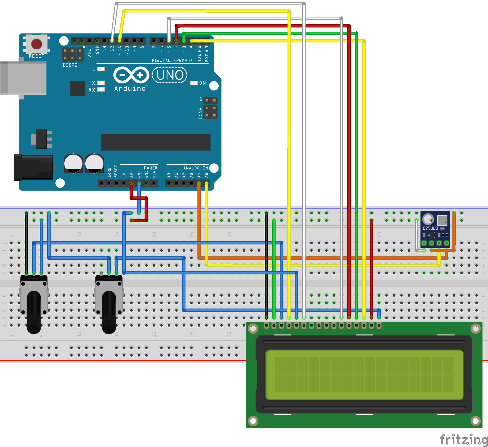

<h1>ZGP-1</h1>
ZGP-1 is proof-of-a-concept prototype of probe that measures temperature and displays it on the LCD display together with time since powering up and allows the user to adjust the backlight and text opacity levels. As the first probe, it did not have its own energy source - it relied on the computer to be powered up.

  

Code is available <a href="./src/main.ino">here</a>.

<h2>Components</h2>
<ul>
    <li>1x Arduino Uno R3 SMD Edition</li>
    <li>1x BMP180 - Pressure/Temperature Sensor</li>
    <li>1x LCD 16x2</li>
    <li>2x Rotary Encoder - The knob</li>
    <li>Cables/Wires</li>
    <li>USB-B to USB-A cable</li>
</ul>

<h3>Schema</h3>

    

<h2>Requirements</h2>
<ul>
    <li>The probe shall measure temperature using a sensor.</li>
    <li>The telemetry shall be displayed on the LCD screen.</li>
    <li>The user shall be able to adjust the background lighting.</li>
    <li>The user shall be able to adjust the opacity of the LCD text</li>
    <li>The LCD shall display the time since powering up in seconds.</li>
</ul>

<h2>Testing</h2>
Since no battery was being used, this probe was not tested for self-sustainablity/energy-idenpendence but rather for the functionalities. This was a proof-of-concept.

<h2>For the next probe</h2>
TBA