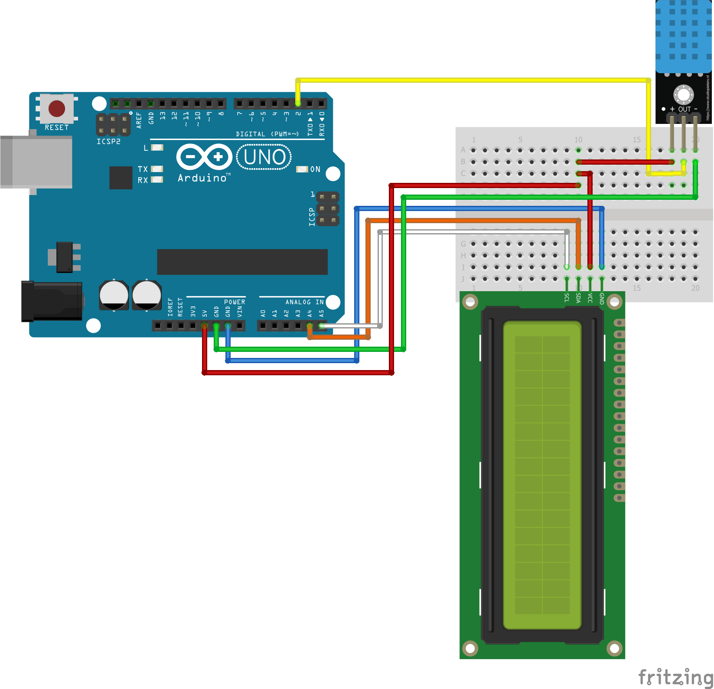

<h1>ZGP-2</h1>

<b>Name: </b>ZGP-2 "Polaris" 
<b>Developed in: </b>2021 
<b>Status: </b>Finished  
<b>Main Component: </b>Arduino Uno Rev3 SMD 
<b>Power Source: </b>9v Battery 
<b>Measuring: </b>Temperature 

Probe summary in a few sentences  

<table align="center">
  <thead>
    <tr>
      <th markdown><a href="./src/main.ino">Code</a></th>
      <th markdown><a href="">Video</a></th>
    </tr>
  </thead>
</table>

  

<h2>Components</h2>
<ul>
    <li>1x Main Component</li>
    <li>1x Breadboard</li>
    <li>1x ...</li>
    <li>1x ...</li>
    <li>Cables/Wires</li>
    <li>USB-B to USB-A cable</li>
</ul>

<h3>Schema</h3>

    

<h4>Pin Mapping</h4>
<table align="center">
    <tr><th>Component</th><th>Interface</th></tr>
    <tr><td>...</td><td>Pin1, Pin2</td></tr>
    <tr><td>...</td><td>Pin1, Pin2</td></tr>
    <tr><td>...</td><td>Pin1, Pin2</td></tr>
    <tr><td>...</td><td>Pin1, Pin2</td></tr>
</table>

<h2>Requirements</h2>
<h3>Functional Requirements:</h3>
<ol>
    <li>...(✅ if fulfilled)</li>
</ol>

Other Requirement types may be applicable (NFR, Constraints...)

<h2>Testing</h2>
...

<h2>Recommendations for the next probe</h2>
<ul>
    <li>...</li>
</ul>
